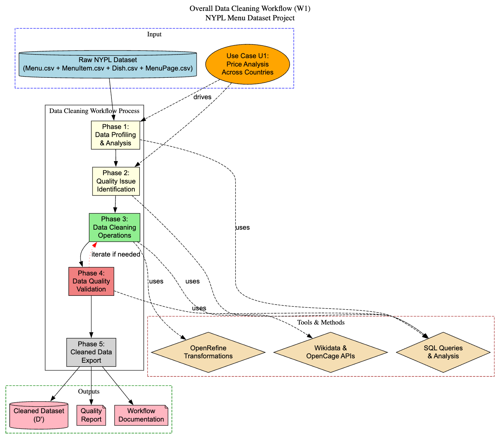
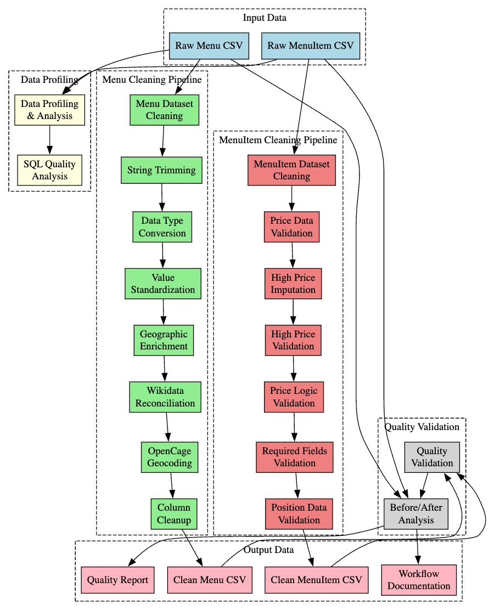

# Data Cleaning Workflow Model

## Overall Workflow (W1) - High-Level Data Cleaning Process

Pseudo diagram

```
┌─────────────────┐    ┌─────────────────┐    ┌─────────────────┐
│   Raw NYPL      │    │  Data Profiling │    │  Quality Issue  │
│   Dataset (D)   ├───►│   & Analysis    ├───►│  Identification │
│                 │    │                 │    │                 │
└─────────────────┘    └─────────────────┘    └─────────────────┘
                                                        │
                                                        ▼
┌─────────────────┐    ┌─────────────────┐    ┌─────────────────┐
│   Data Quality  │    │  Cleaned Data   │    │  Data Cleaning  │
│   Validation    │◄───┤   Export (D')   │◄───┤   Operations    │
│                 │    │                 │    │                 │
└─────────────────┘    └─────────────────┘    └─────────────────┘
```

Graphviz visual representation


### Workflow Steps Description:

**Step 1: Data Profiling & Analysis**
- Tools: SQL queries, OpenRefine data preview
- Purpose: Understand data structure, identify quality issues
- Input: Raw NYPL Menu and MenuItem CSV files
- Output: Quality assessment report

**Step 2: Quality Issue Identification**  
- Tools: SQL denial constraint queries
- Purpose: Systematically identify data quality violations
- Input: Profiling results
- Output: List of specific data quality problems

**Step 3: Data Cleaning Operations**
- Tools: OpenRefine, SQL transformations
- Purpose: Address identified quality issues
- Input: Raw data + quality issue list
- Output: Transformed datasets

**Step 4: Data Quality Validation**
- Tools: SQL integrity constraint checks
- Purpose: Verify cleaning effectiveness
- Input: Cleaned datasets
- Output: Quality validation reports

**Step 5: Cleaned Data Export**
- Tools: OpenRefine export, file management
- Purpose: Prepare final cleaned datasets
- Input: Validated clean data
- Output: Final cleaned CSV files (D')

## Detailed Data Cleaning Workflow (W2) - Inner Operations

### Menu Table Cleaning Pipeline:

```
Raw Menu Data
      │
      ▼
┌─────────────────┐
│ String Trimming │ ── Remove whitespace from all string columns
│                 │    (place, location, sponsor, event, venue, etc.)
└─────────┬───────┘
          │
          ▼
┌─────────────────┐
│ Data Type       │ ── Convert id, dish_count, page_count to numbers
│ Conversion      │    Convert date strings to date objects
└─────────┬───────┘
          │
          ▼
┌─────────────────┐
│ Value           │ ── Mass edit event column (standardize categories)
│ Standardization │    Mass edit occasion column (clean punctuation)
└─────────┬───────┘
          │
          ▼
┌─────────────────┐
│ Data Enrichment │ ── Create place_cleaned column for reconciliation
│ Preparation     │    Create date_timeless formatted string
└─────────┬───────┘
          │
          ▼
┌─────────────────┐
│ Geographic      │ ── Reconcile places with Wikidata
│ Reconciliation  │    Extract country information
└─────────┬───────┘
          │
          ▼
┌─────────────────┐
│ API Data        │ ── Use OpenCage API for missing countries
│ Enhancement     │    Merge Wikidata + OpenCage results
└─────────┬───────┘
          │
          ▼
┌─────────────────┐
│ Column Cleanup  │ ── Remove unnecessary/duplicate columns
│                 │    (language, keywords, location_type, temp cols)
└─────────┬───────┘
          │
          ▼
    Clean Menu Data
```

### MenuItem Table Cleaning Pipeline:

```
Raw MenuItem Data
      │
      ▼
┌─────────────────┐
│ Price Data      │ ── Remove rows with missing/invalid/negative prices
│ Validation      │    Filter out 445,916 problematic rows
└─────────┬───────┘
          │
          ▼
┌─────────────────┐
│ High Price      │ ── Fill missing high_price with price values
│ Imputation      │    (1,240,821 rows affected)
└─────────┬───────┘
          │
          ▼
┌─────────────────┐
│ High Price      │ ── Remove non-numerical high_price values
│ Validation      │    Ensure data type consistency
└─────────┬───────┘
          │
          ▼
┌─────────────────┐
│ Price Logic     │ ── Remove rows where price > high_price
│ Validation      │    (1,274 constraint violations fixed)
└─────────┬───────┘
          │
          ▼
┌─────────────────┐
│ Required Field  │ ── Remove rows with missing key identifiers
│ Validation      │    (id, menu_page_id, timestamps, positions)
└─────────┬───────┘
          │
          ▼
┌─────────────────┐
│ Position Data   │ ── Remove rows with non-numerical xpos/ypos
│ Validation      │    Ensure coordinate data integrity
└─────────┬───────┘
          │
          ▼
   Clean MenuItem Data
```

Graphviz visual representation:



## Tools and Technologies Used:

### Primary Tools:
- **OpenRefine**: Main data cleaning interface
  - Text transformations and trimming
  - Mass editing and clustering
  - Data type conversions
  - Wikidata reconciliation
  - API integrations (OpenCage)

- **SQL**: Data validation and profiling
  - Integrity constraint checking
  - Denial constraint queries
  - Before/after comparison analysis

### Supporting Tools:
- **Wikidata API**: Geographic entity reconciliation
- **OpenCage API**: Geocoding for missing country data
- **CSV Export/Import**: Data pipeline management

## Workflow Design Rationale:

### Tool Selection Justification:
1. **OpenRefine Choice**: Selected for its interactive data exploration capabilities, built-in reconciliation services, and comprehensive transformation options
2. **SQL Integration**: Chosen for systematic validation and quantitative analysis of data quality improvements
3. **API Integration**: Wikidata and OpenCage APIs selected to enhance geographic data completeness

### Workflow Dependencies:
- String trimming must precede all text-based operations
- Data type conversion required before numerical validations
- Geographic reconciliation depends on cleaned place names

### Quality Assurance Approach:
- Before/after SQL validation for each cleaning step
- Integrity constraint monitoring throughout process
- Quantitative tracking of changes per column
- Systematic documentation of all transformations

This workflow successfully reduced data quality violations from hundreds of thousands to zero across multiple constraint categories, enabling reliable analysis for the main use case U1.
